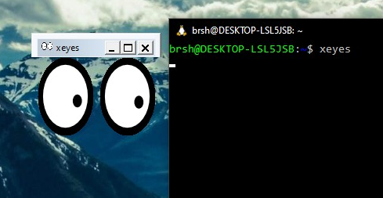
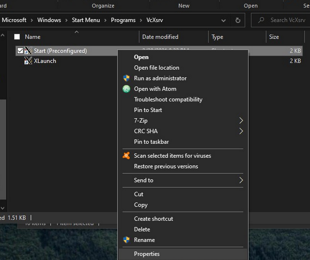
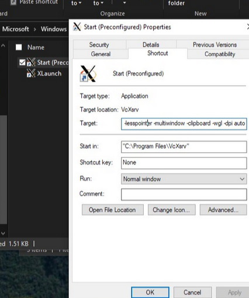

# Windows: Windows Subsystem for Linux

<div class="inline-img">
    
    <p>Fake Linux!</p>
</div>

<a href="https://learn. microsoft.com/en-us/windows/wsl/about" class="external-link">Windows Subsystem for Linux</a>
atau WSL memperbolehkan pengguna Windows untuk menggunakan alat-alat umum Linux pada Windows.
Banyak alat-alat kernel development hanya tersedia pada platform Linux, sehingga WSL akan digunakan sebagai *lightweight VM* untuk pengerjaan tugas ini.

Install WSL2 sesuai instruksi yang terdapat pada
<a href="https://learn.microsoft.com/en-us/windows/wsl/install" class="external-link">https://learn.microsoft.com/en-us/windows/wsl/install</a>.
Disarankan untuk memasang distro Ubuntu atau Debian.

<div class="warning">
    <p>
        Pastikan untuk menginstall WSL2
        <span style="font-size:8pt;">(bukan WSL1)</span>
        dan Windows versi terbaru
        <span style="font-size:8pt;">(Windows 10 21H2+ atau 11)</span>
    </p>
</div>

<br/>

## WSL: GUI Application
Boot distro WSL dan pasang `xeyes` untuk menguji WSL yang diinstall dapat menampilkan GUI

```bash
sudo apt install x11-apps # Debian, Ubuntu
sudo dnf install xeyes    # Fedora, RHEL
```

Jalankan command `xeyes`. Jika WSL berjalan dengan normal akan muncul window baru dengan mata yang mengikuti kursor mouse.

<div class="inline-img">
    
    <p>👀 👀 👀</p>
</div>

Jika command `xeyes` berjalan tetapi tidak muncul apapun,
cek ulang versi Windows atau coba untuk memasang <a href="#fallback-solution-manual-x11-server" class="internal-link">X11 server</a> secara manual.

Lanjutkan pemasangan 
`code --install-extension ms-vscode-remote.remote-wsl`


> <div class="info-title">
>   
>   <span>WSL 2 & WSLg</span>
> </div>
>
> Kecuali memiliki alasan tertentu, Microsoft merekomendasikan untuk memasang WSL2.
> Berbeda dengan WSL1, WSL2 dapat menjalankan 32-bit ELF executable dan dengan mudah dapat berinteraksi filesystem milik Windows.
>
> WSLg merupakan fitur WSL terbaru yang membuat aplikasi didalam WSL dapat menampilkan GUI.
> Aplikasi seperti Firefox, QEMU, xeyes membutuhkan WSLg atau X11 Server untuk dapat menampilkan UI.
> Beruntungnya Windows 10 dan 11 versi terbaru sudah secara default menyediakan WSLg ketika menginstall WSL.

<br/>

## Fallback GUI Solution: Manual X11 Server
1. Pasang X11 Server seperti <a href="https://sourceforge.net/projects/vcxsrv/" class="external-link">VcXsrv</a>
2. Cari shortcut XLaunch yang ada pada start menu, contoh:
    <span style="white-space: nowrap;">`C:\ProgramData\Microsoft\Windows\Start Menu\Programs\VcXsrv`</span>
    <div class="inline-img">
        
    </div>

3. Klik kanan & buka "Properties"
4. Tambahkan line berikut pada akhir kolom "Target":
    <span style="white-space: nowrap;">`:0 -ac -terminate -lesspointer -multiwindow -clipboard -wgl -dpi auto`</span>
    <div class="inline-img">
        
    </div>

5. Buka WSL dan jalankan command berikut:
    <span style="white-space: nowrap;">```echo 'export DISPLAY=`grep -oP "(?<=nameserver ).+" /etc/resolv.conf`:0.0'>> ~/.bashrc```</span>

6. Restart WSL (Command line `wsl --shutdown` dan buka ulang) dan jalankan shortcut VcXsrv yang telah diedit
7. Coba ulang command `xeyes`
