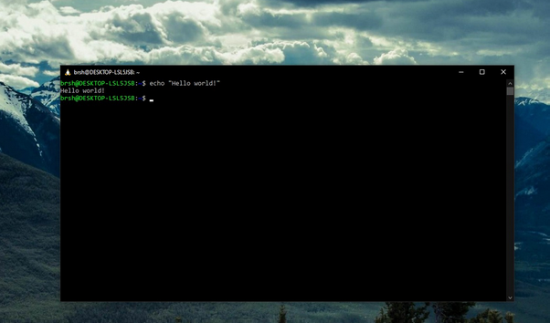

# Windows: Windows Subsystem for Linux

    
    
Fake Linux!

<a href="https://learn.microsoft.com/en-us/windows/wsl/about" class="external-link">Windows Subsystem for Linux</a>
atau WSL memperbolehkan pengguna Windows untuk menggunakan alat-alat umum Linux pada Windows.
Banyak alat-alat kernel development hanya tersedia pada platform Linux, sehingga WSL akan digunakan sebagai *lightweight VM* untuk pengerjaan tugas ini.

Install WSL2 sesuai instruksi yang terdapat pada
<a href="https://learn.microsoft.com/en-us/windows/wsl/install" class="external-link">https://learn.microsoft.com/en-us/windows/wsl/install</a>.

<!-- TODO: Latest version of Win10 or Win11 already shipped with WSLg -->

<!-- Direkomendasikan untuk memasang WSL 2 dibandingkan WSL 1. WSL 2 dapat menjalankan 32-bit ELF executable dan sebagian besar utility berfungsi secara normal pada WSL 2.
Instalasi WSL 2 dapat dicek pada link . Pastikan Windows 10 telah terupdate sebelum menjalankan instruksi pada link diatas. Untuk distribusi linux, direkomendasikan memasang distribution Ubuntu 20.04.

Jika menggunakan Windows 10, lanjutkan langkah Instalasi XServer. Jika menggunakan Windows 11 (dengan versi terupdate, jika tidak bisa (dapat dites dengan aplikasi xeyes), lanjutkan install XServer seperti Win10) langsung lanjut ke bagian Setup Visual Studio Code -->
