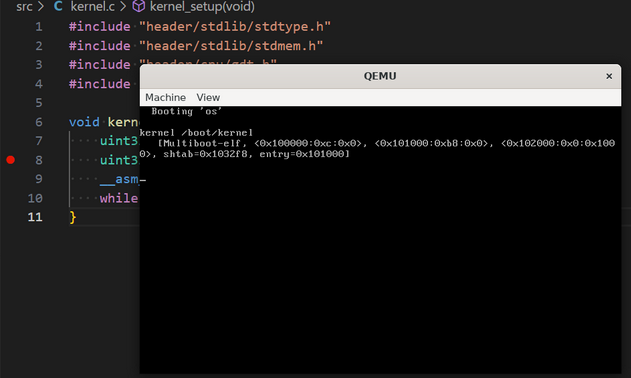

# Chapter 1: Toolchain, Kernel, GDT

Chapter ini akan menyiapkan repository awal yang akan digunakan selama pengerjaan.
Pada akhir chapter, sistem operasi dengan kernel mini dapat dijalankan menggunakan QEMU dan VSCode.

    
    
QEMU: Sistem Operasi!

Dimulai dengan menyiapkan [1.1. Repository & Toolchain](./repository.md) yang digunakan untuk build sistem operasi,
membuat [1.2 Kernel](./kernel.md) sistem operasi sederhana,
dan ditutup dengan pembuatan [1.3. Global Descriptor Table](./gdt.md).
